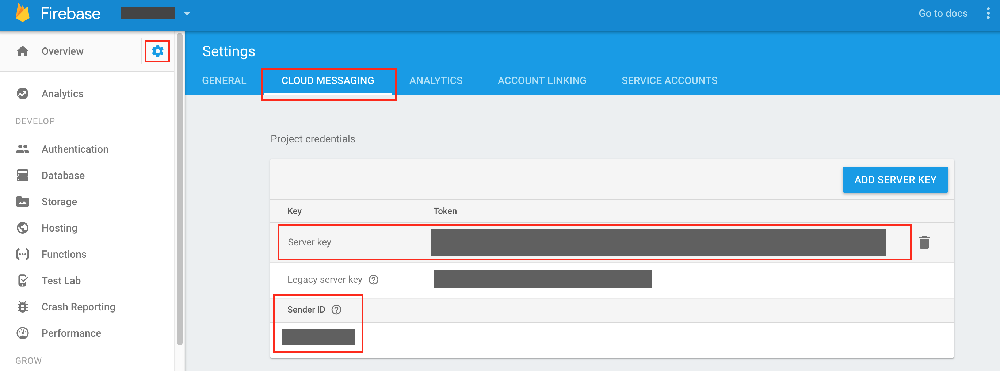

# Cordova Android installation

## Add the SDK Key
Tango Targeting SDK auto-initializez on Android. However, it needs to read your Tango SDK Key from AndroidManifest.xml file. In your `config.xml` add the SDK Key to the android platform in the following manner:

```xml
<platform name="android">
  <!-- other configurations above -->
  <config-file parent="./application" target="AndroidManifest.xml">
    <meta-data android:name="tango_api_key" android:value="your-tango-sdk-key" />
  </config-file>
  <!-- other configurations below -->
</platform>
```

## Enable Tango logs

If you want to see Tango logs add a `tango_debug_mode` `meta-data` set to `true` to your android platform.

```xml
<meta-data android:name="tango_debug_mode" android:value="true" />
```

## Enable Push Notifications

Tango Targeting uses FCM for push notifications. For this you will need a [Firebase](https://firebase.google.com/) account. After successfully creating the account follow these steps.

1. Go to [Firebase Console](https://console.firebase.google.com/);
2. Add a new project;
3. When the project is created, click on *Add Firebase to your Android app*. A pop-up window will appear with 3 steps;
4. In the first step your android package name is required. This can be found in your project's *config.xml* file. Look for `<widget android-packageName="com.yourapp.android" />` if `android-packageName` is missing, use the `id` attribute;
5. Click **Register app**. It will take you to step 2;
6. Download the file *google-services.json* and copy it in the root folder of your cordova project;
7. Close the pop-up window;
8. Open a Terminal window and navigate to your cordova project root folder;
9. Run `cordova build android`;

To finalize the process, copy the FCM **Server key** and **Sender Id** from here:


Then go to *Tango Console -> Apps* and add them to your app.


Hit the **Update** button.

**Note:** If you don't see your app yet, click **New app** to add it. Use the same package name you used for FCM.

## Add permissions

Tango SDK relies on the following permissions:

```xml
<!-- Runtime permissions-->
<uses-permission android:name="android.permission.READ_EXTERNAL_STORAGE"/>
<uses-permission android:name="android.permission.ACCESS_FINE_LOCATION"/>

<!--Normal permissions-->
<uses-permission android:name="com.android.browser.permission.READ_HISTORY_BOOKMARKS"/>
<uses-permission android:name="android.permission.INTERNET"/>
<uses-permission android:name="android.permission.RECEIVE_BOOT_COMPLETED"/>
```

You do not need to add these permissions to your Android Manifest file. However, if your ` targetSdkVersion` is higher than **22** you will need to request the `android.permission.ACCESS_FINE_LOCATION` and `android.permission.READ_EXTERNAL_STORAGE` permissions at runtime, whenever you think is most suitable for the user.

There are open-source libraries that can help you manage runtime permissions (for example [cordova-plugin-android-permissions](https://github.com/NeoLSN/cordova-plugin-android-permissions))

## You are ready to go!
At this point you should be able to use Tango.

## Troubleshooting

### 1. Firebase error/crash
If you get an error from firebase saying *default FirebaseApp is not initialized in this process* and tells you too initialize it with `FirebaseApp.initializeApp(context)`, please make sure the *google-services.json* file is in the root folder of your Cordova project.

### 2. Changing the android package name
If you decide to change the name of your android package, you should update the application in your Firebase Console. 

[1]: http://tangotargeting.com