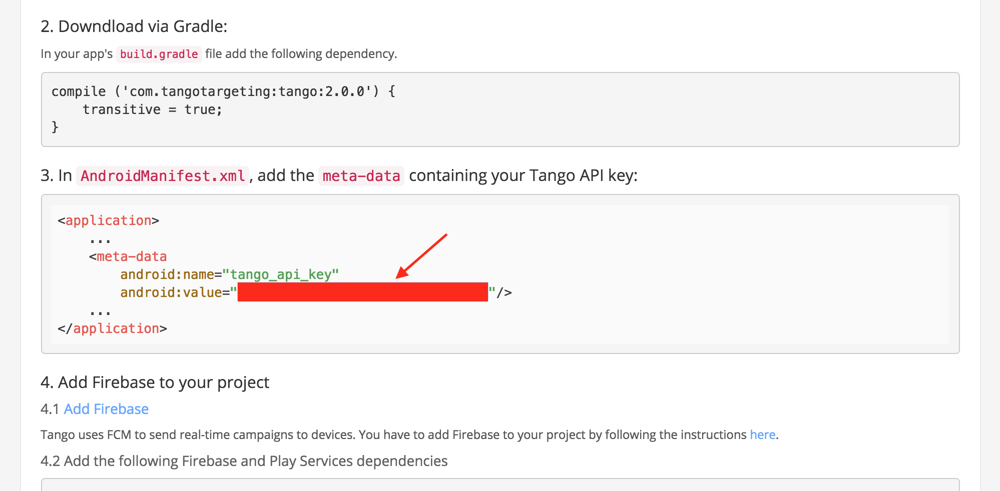

# Cordova Plugin Overview


## Download
There are three ways you can add *cordova-plugin-tango* to your Cordova project:

#### via ```config.xml``` dependency
```xml
<plugin name="cordova-plugin-tango" spec="<specify-version>" />
```
#### from npmjs
Navigate to your project and run the following line:

```
cordova plugin add cordova-plugin-tango
```

#### from Git
Navigate to your project and run:

```bash
cordova plugin add https://github.com/tangotargeting/cordova-plugin-tango.git
```

## Installation

- [Android](android.md)
- [iOS](ios.md)

## Usage

### Find your Tango API Key

The following step requires you to provide the Tango API Key. The easiest way to locate it is to access https://app.tangotargeting.com/integration/android. This is the documentation for integrating Tango with Android. At point 3 you will be able to see the API Key filled in. See the picture below. 



!!! Caution 
	Make sure you **use the Tango API Key** described above, **NOT** the ~~Public API Key~~.

### Prepare the SDK

In order to use it correctly, Tango Targeting SDK should be initialized as soon as possible when your Cordova App launches. In your project's ***index.js*** add the following line at the top of your `onDeviceReady` method.

``` javascript
window.TangoPlugin.initialize('your-tango-api-key');
```

This will register the device on TangoTargeting and prepare it for consuming campaigns.

!!! note
	Explicitly initializing Tango is only needed for iOS. On Android the SDK auto-initializez, provided it can find the API Key in the manifest file. See [Android Installation](https://github.com/tangotargeting/cordova-plugin-tango/blob/master/INSTALLATION-Android.md).

### Trigger an Automated Campaign

Automated campaigns can be triggered using the following method call:

``` javascript
window.TangoPlugin.trigger('your-automated-campaign-trigger');
```

You can find the campaign trigger string by clicking on the campaign in your Tango Console.

### Handle custom actions

Handling a custom action is as easy as extending `TangoPlugin` with the following method:

```javascript
window.TangoPlugin.onCustomAction = function(action){
    // identify the action and do stuff
};
```

### Manage tags

You can add segments to a device to allow it to widen the pool of campaigns it can receive with the following method:

``` javascript
window.TangoPlugin.addSegments(["first-segment", "second-segment"]);
```


## Troubleshooting

1. If you completed the integration but don't receive any campaign, make sure you use the the API Key (see above how to find your API Key) and **NOT** the Public API Key.

2. Sometimes, depending on the version of your Cordova Framework version or Cordova wrappers like Ionic or Phonegap, the configurations in **config.xml** may not be applied to the platforms/android/AndroidManifest.xml. To fix this you can use the **cordova-custom-config** plugin which will make sure the configurations will pe applied to their respective platforms.  


[1]: http://tangotargeting.com