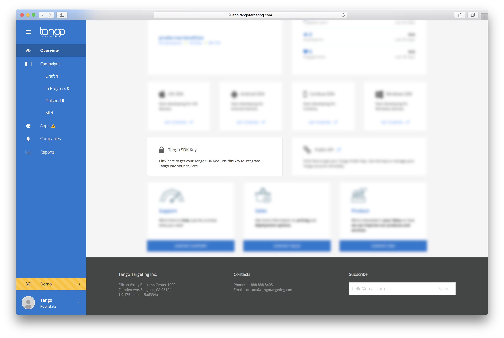

Please follow the steps bellow to integrate Tango into your project:

### Tango framework

Open your project's AppDelegate file and import the Tango framework.

```swift fct_label="Swift"
import Tango
import UserNotifications
```

```objc fct_label="Objective-C"
#import <Tango/Tango-Swift.h>
#import <Tango/Tango.h>
#import <UserNotifications/UserNotifications.h>
```

The `UNUserNotificationCenterDelegate` protocol defines methods for responding to actionable notifications. So, to respond to the action, let’s have `AppDelegate` implement the `UNUserNotificationCenterDelegate` protocol:

```swift fct_label="Swift"
class AppDelegate: UIResponder, UIApplicationDelegate, UNUserNotificationCenterDelegate {}
```

```objc fct_label="Objective-C"
@interface AppDelegate : UIResponder <UIApplicationDelegate, UNUserNotificationCenterDelegate>
```

In the `didFinishLaunchingWithOptions`, setup notification delegate and initialize the Tango Targeting SDK with your Tango SDK key by calling `Tango.initialize()`.

```swift fct_label="Swift"
UNUserNotificationCenter.current().delegate = self

// Initialize with API key
Tango.initialize(tango: "your-tango-sdk-key")
```

```objc fct_label="Objective-C"
UNUserNotificationCenter *center = [UNUserNotificationCenter currentNotificationCenter];
center.delegate = self;

[Tango initializeWithTango:@"your-tango-sdk-key"];
```

!!! Important
    To find your Tango API KEY [Go to Console :fa-external-link:](https://app.tangotargeting.com/) and locate the card **Tango SDK Key**, then hover it and click the copy icon on the right side.
    [](../../images/content/locate-apikey-overview.png)

After that you should implement the following delegate methods.

```swift fct_label="Swift"
func application(_ application: UIApplication, didReceiveRemoteNotification userInfo: [AnyHashable : Any], fetchCompletionHandler completionHandler: @escaping (UIBackgroundFetchResult) -> Void) {
    Tango.application(application, didReceiveRemoteNotification: userInfo)
}

func application(_ application: UIApplication, didRegisterForRemoteNotificationsWithDeviceToken deviceToken: Data) {
    Tango.application(application, didRegisterForRemoteNotificationsWithDeviceToken: deviceToken)
}

func application(_ application: UIApplication, didFailToRegisterForRemoteNotificationsWithError error: Error) {
    Tango.application(application, didFailToRegisterForRemoteNotificationsWithError: error)
}

func application(_ application: UIApplication, didReceiveRemoteNotification userInfo: [AnyHashable : Any]) {
    Tango.application(application, didReceiveRemoteNotification: userInfo)
}

func application(_ application: UIApplication, didRegister notificationSettings: UIUserNotificationSettings) {
    Tango.application(application, didRegister: notificationSettings)
}

func application(_ application: UIApplication, didReceive notification: UILocalNotification) {
    Tango.application(application, didReceive: notification)
}
```

```objc fct_label="Objective-C"
- (void)application:(UIApplication *)application didReceiveRemoteNotification:(nonnull NSDictionary *)userInfo
{
    [Tango application:application didReceiveRemoteNotification:userInfo];
}

- (void)application:(UIApplication *)application didRegisterForRemoteNotificationsWithDeviceToken:(nonnull NSData *)deviceToken
{
    [Tango application:application didRegisterForRemoteNotificationsWithDeviceToken:deviceToken];
}

- (void)application:(UIApplication *)application didFailToRegisterForRemoteNotificationsWithError:(nonnull NSError *)error
{
    [Tango application:application didFailToRegisterForRemoteNotificationsWithError:error];
}

- (void)application:(UIApplication *)application didReceiveRemoteNotification:(nonnull NSDictionary *)userInfo fetchCompletionHandler:(nonnull void (^)(UIBackgroundFetchResult))completionHandler
{
    [Tango application:application didReceiveRemoteNotification:userInfo];
}

- (void)application:(UIApplication *)application didRegisterUserNotificationSettings:(nonnull UIUserNotificationSettings *)notificationSettings
{
    [Tango application:application didRegister:notificationSettings];
}

- (void)application:(UIApplication *)application didReceiveLocalNotification:(UILocalNotification *)notification
{
    [Tango application:application didReceive:notification];
}
```

For **iOS 10** you should also add:
```swift fct_label="Swift"
// MARK: UNUserNotificationCenterDelegate Methods

@available(iOS 10.0, *)
func userNotificationCenter(_ center: UNUserNotificationCenter, didReceive response: UNNotificationResponse, withCompletionHandler completionHandler: @escaping () -> Void) {
    Tango.userNotificationCenter(center, didReceive: response, withCompletionHandler: completionHandler)
}

@available(iOS 10.0, *)
func userNotificationCenter(_ center: UNUserNotificationCenter, willPresent notification: UNNotification, withCompletionHandler completionHandler: @escaping (UNNotificationPresentationOptions) -> Void) {
    Tango.userNotificationCenter(center, willPresent: notification, withCompletionHandler: completionHandler)
}
```

```objc fct_label="Objective-C"
// MARK: UNUserNotificationCenterDelegate Methods

- (void)userNotificationCenter:(UNUserNotificationCenter *)center willPresentNotification:(UNNotification *)notification withCompletionHandler:(void (^)(UNNotificationPresentationOptions options))completionHandler
{
    [Tango userNotificationCenter:center willPresent:notification withCompletionHandler:completionHandler];
}

- (void)userNotificationCenter:(UNUserNotificationCenter *)center didReceiveNotificationResponse:(UNNotificationResponse *)response withCompletionHandler:(void(^)(void))completionHandler
{
    [Tango userNotificationCenter:center didReceive:response withCompletionHandler:completionHandler];
}

```

!!! important "Location tracking"
    If you are going to use a location campaign you need to add in your `plist` the following key: `NSLocationAlwaysUsageDescription`.
