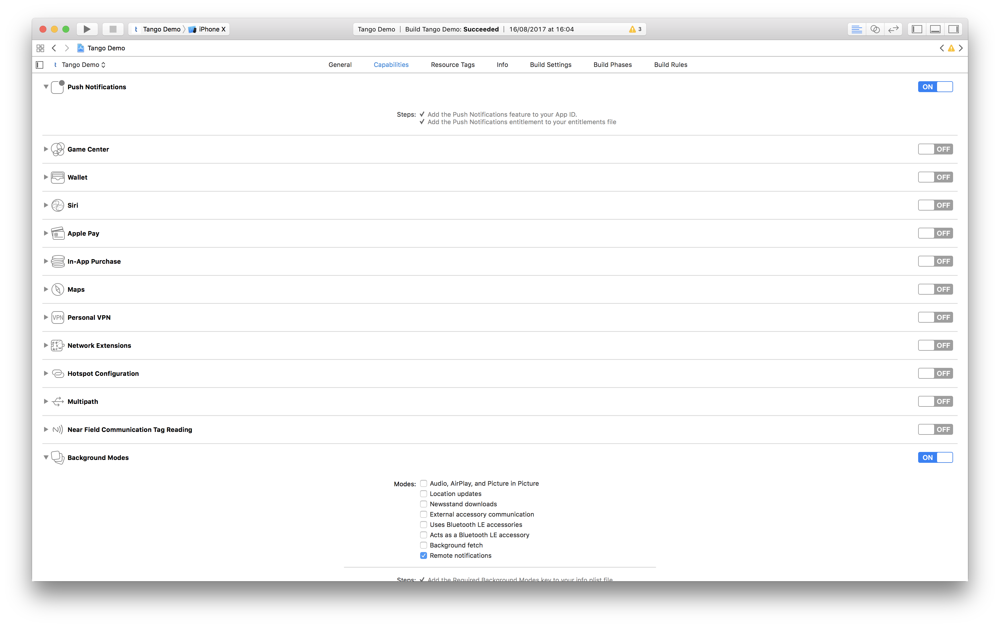
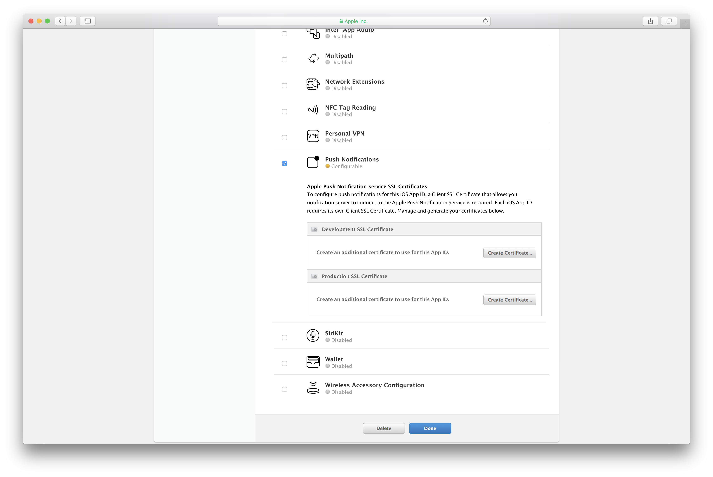
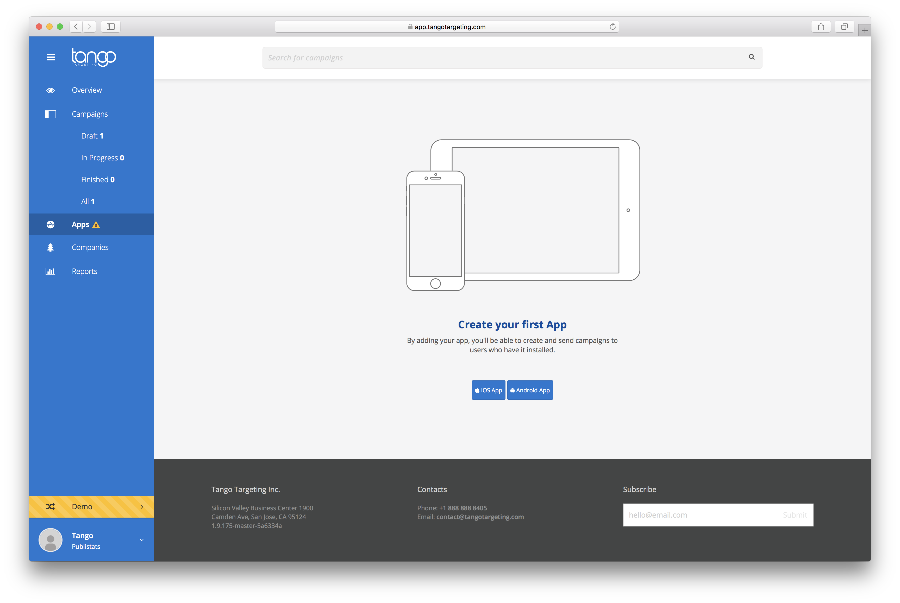
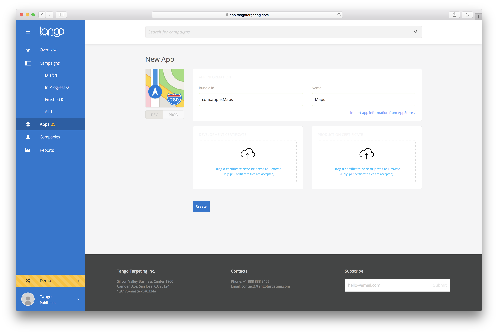

!!! note "Reminder"
    In order to use push notifications in your iOS app, a membership for the [iOS Developer Program](https://developer.apple.com/programs/) is required. Be sure to be logged in XCode with your developer account, before proceeding.

### App capabilities

Push notifications require some specific capabilities enabled. Select the target’s Capabilities pane in XCode and enable **Push notifications** and **Background Modes/Remote notifications capabilities**:

After enabling these two capabilities, build & run your app. Check your app output in the Debug area and wait until Tango finishes initialisation. This process will sync your app with Tango, which will make it easier for you in the following steps.

### APNs Setup
Apple Push Notification service (APNs) is the centerpiece of the remote notifications feature and requires some special certificates that you can generate in the [Apple Developer Members Center](https://developer.apple.com/account/ios/certificate/). Once there, click on App IDs from Identifiers section, then follow the steps provided below.

1. Select your app id. If you don't have an app id created select +  button and fill out the form, be sure you check Push Notification checkbox.
2. Expand your app by selecting your app id and you will see a field named Push Notifications with yellow or green status icons for development or distribution: 
3. Click edit button, go to Push Notifications section and press the button **Create Certificate...** for distribution or development. Follow the instructions to create a Certificate Signing Request (CSR) file from your Mac. When you're done, press **Continue**.
4. Upload the CSR and after that press download to get the Certificate.
5. Open the certificate. Opening the certificate will open Keychain Access.
6. Select your certificate from  Keychain Access in My Certificates section. If the certificate is not here try in Certificate section. Right click on it and then Export "Apple iOS Development/Distribution Push Service: your_app_bundle".
This command will export the certificate in a .p12 file with a password.

### Add Certificate to Tango
After generating the Push Notification certificate, navigate to the [apps page](https://app.tangotargeting.com/apps) and create a new iOS app:

!!! note "App synced with Tango"
    If you already ran your app while having Tango SDK set up, you would find it listed in the Tango console's apps page. In this case, just click on the app icon and follow along.

Continue by fill the form with your app data:

1. insert app bundle id
2. insert app name
3. drag and drop the .p12 files from previous step

!!! info "Import app information from the AppStore"
    If your app is already published in the Apple AppStore, you can fetch the name and icon by pressing the *Import app information from AppStore* button after entering the bundleId.

Please continue reading the [Tango Rich Notifications Setup](/developer-guide/ios/tango-rich-notifications-setup/) chapter, in order to finish integrating Tango SDK into your app.

[1]: http://tangotargeting.com

### Test

At this point you should be ready to go. To test if the installation succeeded you should enter the Tango Targeting account then create and activate some campaigns. The easiest way is to create a real-time campaign but it pays off to test all campaigns as some of them have specific needs(like location permissions).

If a campaign doesn't trigger it is possible it did not reach the device yet as the synchronization is triggered approximately every ten minutes. To go around this, you could simply restart the application and a synchronization will immediately trigger. Note that real-time campaigns don't need any synchronization to work.
