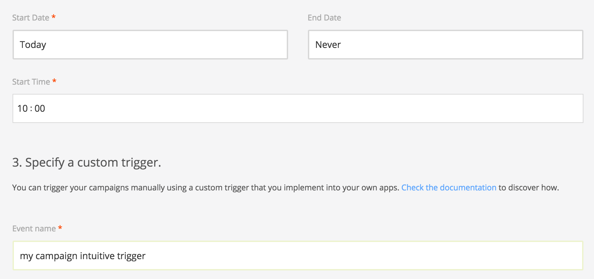

Sometimes having predefined types of campaigns is not enough. In some cases none of the campaign types apply for a desired use case. For instance, imagine a photo gallery application for which you want a campaign triggered after every ten viewed photos. None of the other campaigns apply for this case. To solve this we have created Automated Campaigns. Basically, an Automated Campaign comes with predefined trigger(which is a string), used to trigger the campaign whenever desired. 

To start creating an automated campaign go to your Tango account and select the Campaigns tab in the left side menu. Press on New Campaign and select a platform you want to create the campaign for. Then simply choose Automated Campaign. On the next page input the title of the campaign. 

Next, set the period period the campaign should be active. In the following image the campaign is set to start today at 10:00 am and never end.

The last field is where the trigger should be defined. It should be an descriptive and intuitive short sentence. Once you're done with this step, press **Continue** and follow the next steps covered in [[Creating a campaign]].

!!! info
	After you finished creating the campaign some work must done development-wise, which is adding the code deciding when to trigger the campaign and actually triggering it through Tango Targeting SDK. For full instructions on how to do that, please follow the guides [Android](/developer-guide/android/trigger-automated-campaigns) and [iOS](/developer-guide/ios/trigger-automated-campaigns).

