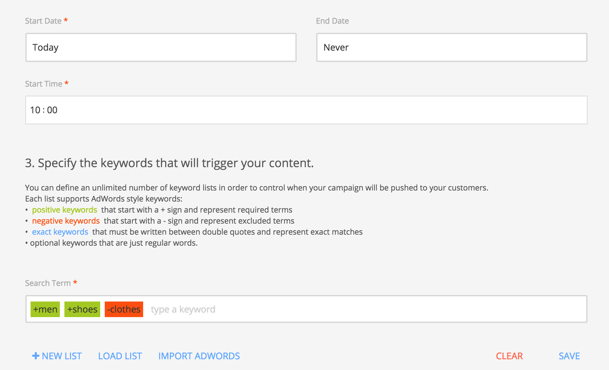

!!! warning
	Search Campaigns apply only for Android API 22 or less. Also, iOS is not supported.

There are cases when you want to interact with a customer based on what a search he or she made on the web. As a shoes retailer, you may want to present some offers when someone searched for "men's shoes" or "women's shoes". We made this possible with search based campaigns which rely on AdWords style keywords.

To start creating a recurrent campaign go to your Tango account and select the *Campaigns* tab in the left side menu. Press on **New Campaign** and select as your platform. Then, simply choose **Search Campaign**. 

After filling the campaign name, set the period the campaign should be active. Further on, specify the keywords that will trigger the campaign. The rules for keywords are as follows:

* **+positive keywords** - must be inputed with a leading "+" sign and represent keywords that must appear in the search phrase. Example: for the *+men's* keyword the search phrase "men's shoes" will match, whereas "women's shoes" will fail;
* **-negative keywords** - must be inputed with a leading "-" sign and represent keywords that must not be present in the search. Example: for the *-men's* keyword the search phrase "men's and women's shoes" will fail, whereas "men's shoes" will match;
* **"exact keywords"** - must be wrapped with double quotes and represent expressions that must be present in the search phrase exactly as specified. Example: for the *"men's shoes"* the search phrase "men's blue shoes" will fail, whereas "men's shoes in Orlando" will match.

You can save the keywords for later usage and if you already had defined Google AdWords in other projects and want to reuse them you can do so by clicking **IMPORT ADWORDS**.