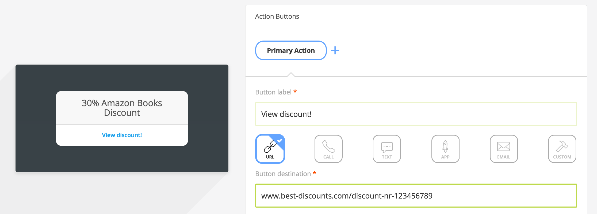

At Tango Targeting we view a campaign is a process of presenting messages to users and collecting their "responses". Each campaign is composed of **a message**, **a set of actions**, **a set of rules** for presenting the message **and useful insights** based on the aggregated user actions data.

### The message

Probably the most important part of a campaign is the message it sends to the users. This message is responsible, in most cases, for convincing the user to take action. Here are a few examples of messages that can be presented to the users.

Naturally, there is a minimum required for each message and it can be implemented in a matter of seconds. However as previously stated, this is what your users will see, so we recommend investing some time in writing a good message. You can also checkout our [[Guide for writing impactful campaigns]].

Below are the elements of which a message is composed. 

| Element          | Description |
|------------------|-------------|
| Title*           | A short title for your message. Maximum of 30 characters.                                              |
| Body             | Your actual message. Up to 110 characters.                                                             |
| Primary Action*  | A button with an associated action (open a link, make a call, etc.) that the user is expected to take. |
| Secondary Action | A secondary action the user is expected to take.                                                       |
| Image            | An image to enhance the power of the message. At least .png, .jpg, .gif supported. The height can vary to some extent.                     |
| Close*           | Provided by default. It is not considered a user action but rather a dismiss event. 

_The elements marked with asterisk(*) are mandatory._

### Actions
Simply put, an action is what happens when the user taps or clicks a button that comes with a message. For instance, a campaign may be giving away a 30% discount for books bought on Amazon. Naturally, the primary action in this case, should take you to a web page were the user can view the discount code. The image below demonstrates how such an action can be created.

As seen in the image, there are several types of actions you can add to a message. All action types, except **CUSTOM** work out of the box. Here is what each of the does:

* **URL** - opens a web page in your default browser at the specified link
* **CALL** - opens the phone application with the specified number filled
* **TEXT** - opens the messaging application with the number filled (if provided)
* **APP** - attempts to launch the application with the specified identifier (bundleId or package name)
* **EMAIL** - prepares an email in your email application with the specified email filled
* **CUSTOM** - custom actions that are handled at development time

Note that sometimes there are more applications that can perform a specific task. For instance you may have several browsers installed on your device. If the user doesn't have one set as default, the device may present a list of browsers to choose from, when initiating an URL action. 

### Rules

Every campaign comes with a set of rules. Some rules represent limitations, such as the number of times a message can be displayed. Others describe filters, such as audiences or applications. We will cover the rules in the next section of this guide [[Creating a campaign]], where we will walk through the process of creating a campaign.